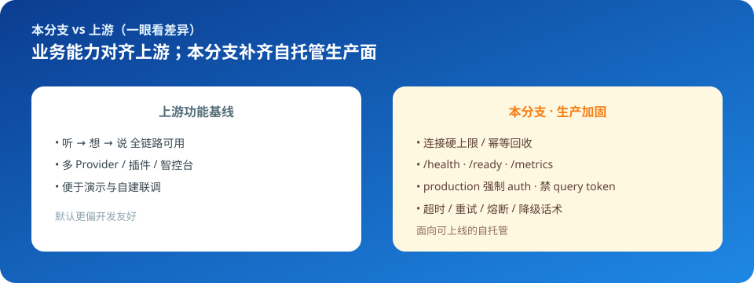
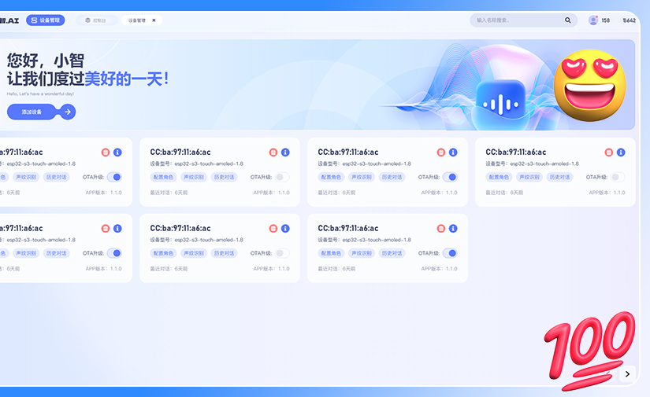
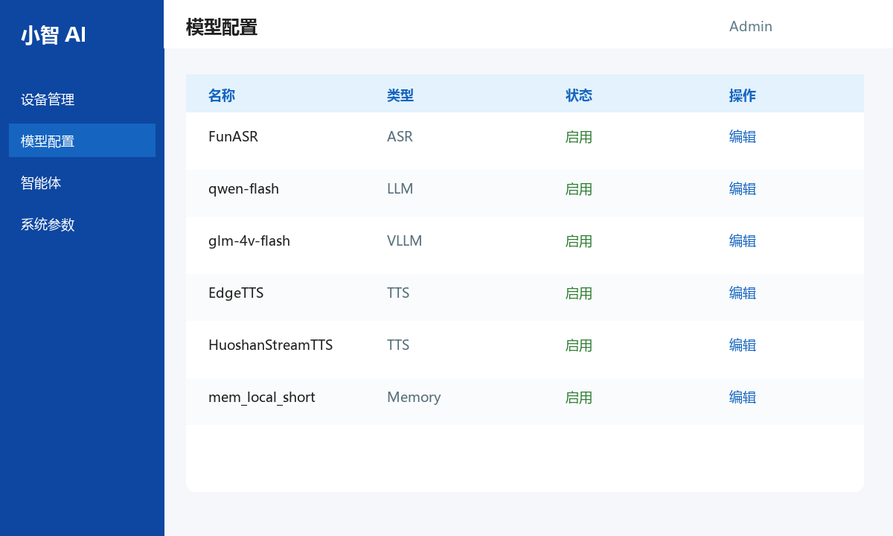
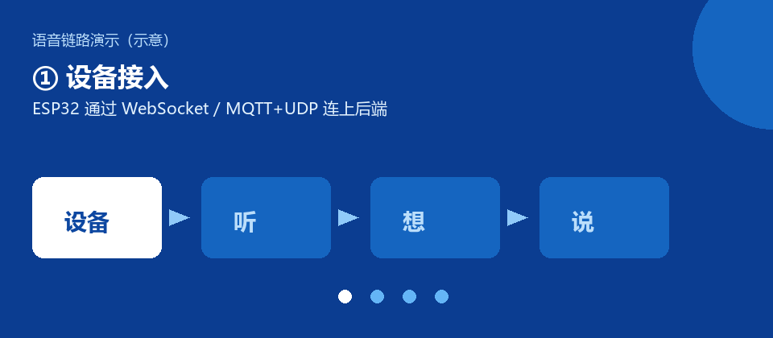

<p align="center">
  <a href="https://github.com/Jehuty-ML/prd_xiaozhi_server">
    
  </a>
</p>

<h1 align="center">xiaozhi-esp32-server · 生产加固分支</h1>

<p align="center">
  <strong>给 ESP32「小智」硬件用的自托管后端</strong><br/>
  设备负责说人话，本仓库负责「听 → 想 → 说」全链路，并提供智控台管理设备与模型。<br/>
  在上游开源功能基线上，补齐连接治理、可观测、安全默认与依赖韧性，方便真正上线自托管。
</p>

<p align="center">
  <a href="#30-秒-quick-start">Quick Start</a> ·
  <a href="#一眼看懂">一眼看懂</a> ·
  <a href="#本分支-vs-上游">vs 上游</a> ·
  <a href="#智控台一览">智控台</a> ·
  <a href="#效果一览">效果</a> ·
  <a href="#开箱部署">部署</a> ·
  <a href="./README_en.md">English</a>
</p>

<p align="center">
  <a href="./README.md"></a>
  <a href="./README_en.md"></a>
  
  
  
  
</p>

---

## 30 秒 Quick Start

> 默认 development，**不要**直接对公网暴露。生产开关见 [Production.md](./docs/Production.md)。

`ash
git clone https://github.com/Jehuty-ML/prd_xiaozhi_server.git
cd prd_xiaozhi_server/main/xiaozhi-server
cp .env.example .env   # 修改 MYSQL_ROOT_PASSWORD 等密钥

# 仅对话 Server（最快跑通）
docker compose -f docker-compose.yml -f docker-compose.prod.yml up -d

# 自检
curl -sS http://127.0.0.1:8003/health
`

全模块（智控台 + MySQL + Redis）用 docker-compose_all.yml + docker-compose_all.prod.yml。详情：[开箱部署](#开箱部署)。

---

## 一眼看懂

<p align="center">
  
</p>

| 你看到的 | 实际是什么 |
|----------|------------|
| 桌上的 ESP32 小设备会聊天、控灯、打电话 | 固件仓库 [78/xiaozhi-esp32](https://github.com/78/xiaozhi-esp32) |
| 设备背后的「大脑」：识别语音、调用大模型、合成回复 | **本仓库**对话网关 `xiaozhi-server` |
| 浏览器里管设备、角色、模型、OTA | 智控台 `manager-web` + `manager-api` |
| 和官方 `xiaozhi.me` 的差别 | 数据与密钥留在你自己的服务器上 |

**和上游的关系（一句话）：**  
业务能力与 [xinnan-tech/xiaozhi-esp32-server](https://github.com/xinnan-tech/xiaozhi-esp32-server) 对齐；本分支专注把「能演示」变成「可自托管上线」。Provider 全家桶、演示视频与社区发行说明仍以上游为准。

---

## 本分支 vs 上游

<p align="center">
  
</p>

| 维度 | 上游功能基线 | 本分支 |
|------|-------------|--------|
| 定位 | 演示与自建联调 | **可上线的自托管生产面** |
| 连接 | 基本无限接纳 | 全局 / 单设备硬上限 |
| 可观测 | 偏日志 | /health /ready /metrics |
| 安全 | 偏联调友好 | production 强制 auth |
| 依赖故障 | 易直接暴露给设备 | 超时 / 重试 / 熔断 / 降级 |

---

## 智控台一览

<p align="center">
  
  
</p>

<p align="center"><em>左：设备管理（来自产品界面）；右：模型配置示意</em></p>

---

## 适合谁

| ✅ 适合 | ❌ 不太适合 |
|--------|------------|
| 已有 / 打算烧录官方小智固件，想自己搭后端 | 只想用官方云、不想运维服务器 |
| 需要按 [小智通信协议](https://ccnphfhqs21z.feishu.cn/wiki/M0XiwldO9iJwHikpXD5cEx71nKh) 对接 WebSocket / MQTT+UDP | 寻找纯 App / 纯网页聊天机器人（无硬件） |
| 关心连接上限、探活、指标、安全默认等生产面 | 只想本地玩一下、对稳定性无要求（直接用上游即可） |

**技术栈一览：**

```
设备 (ESP32)  ──WebSocket / MQTT+UDP──►  xiaozhi-server（对话网关）
                                              │
                         ASR / VAD / LLM / VLLM / TTS / 意图 / 记忆 / 插件
                                              │
                                    manager-api + manager-web（智控台）
```

---

## 效果一览

硬件端是「能说话的 IoT 助手」，不是单一演示板：自定义音色、多语言、设备间通话、复杂场景联动等都在生态里跑通过。

<p align="center">
  
</p>
<p align="center"><em>听 → 想 → 说 链路示意（动画）。实机录屏请看上游演示视频。</em></p>

<p align="center">
  
  
  
</p>
<p align="center">
  
  
</p>

想看完整演示视频与更多场景，请前往上游仓库的 [效果展示区](https://github.com/xinnan-tech/xiaozhi-esp32-server#%E9%80%82%E7%94%A8%E4%BA%BA%E7%BE%A4-)。

---

## 已支持能力（概览）

与上游功能基线一致，主要包括：

| 模块 | 能力 |
|------|------|
| 接入与协议 | WebSocket、MQTT+UDP；OTA；设备认证与多实例发现 |
| 语音交互 | 流式 ASR、VAD、流式 TTS；实时打断；多语言识别 |
| 智能对话 | 多 LLM / VLLM；短期记忆；意图识别 / Function Call |
| 工具与扩展 | 设备端 / 云端 MCP、IoT、插件热加载、MCP 接入点 |
| 声纹与知识库 | 多用户声纹识别；RAGFlow 等知识库 |
| 管理面 | Web / 移动智控台：用户、设备、智能体、模型与系统配置 |

全模块安装时的组件关系：

<p align="center">
  
</p>

更细的 Provider 列表、入门全免费 vs 流式推荐配置、部署教程：

- 上游服务端：[xinnan-tech/xiaozhi-esp32-server](https://github.com/xinnan-tech/xiaozhi-esp32-server)
- 设备固件：[78/xiaozhi-esp32](https://github.com/78/xiaozhi-esp32)

下文只描述 **本分支与上游的差异**（架构选用、生产加固、上线自检）。

---

## 架构选用（必读）

> **先选架构，再部署。** 当前 **`main` 即为单体架构**；另有微服务分支。请按实际规模与运维能力选用，**不必默认上微服务**。

| 分支 | 运行时 | 适合谁 | 代价 / 收益 |
|------|--------|--------|-------------|
| **`main`（当前分支 · 单体）** | `main/xiaozhi-server` | 业务刚起步、设备量不大、希望少人维护 | **部署与排障成本低**；单进程即可跑通全链路。也可多实例 + 负载均衡，配合智控台 / Redis 注册做一定横向扩展 |
| [`Microservices_architecture`](https://github.com/Jehuty-ML/prd_xiaozhi_server/tree/Microservices_architecture) | 六微服务 `main/xiaozhi-microserver` | 高并发接入、要按模块弹性扩容、接入层与 ASR/LLM/TTS 需隔离 | **运维与联调成本更高**；换来按瓶颈单独扩 access / receiver / agent / speaker，以及更好的故障隔离 |

**怎么选：**

1. 多数团队起步应优先留在 **`main`（单体）**——能更快交付，也够支撑相当一段时间的并发。
2. 明确遇到「单机连接/推理互相拖垮」或「必须按语音链路分段扩容」时，再切 **`Microservices_architecture`**。

```bash
# 微服务（高并发 / 弹性扩容）时再切换
git checkout Microservices_architecture
```

更细取舍见微服务分支内 [`main/xiaozhi-microserver/README.md`](https://github.com/Jehuty-ML/prd_xiaozhi_server/blob/Microservices_architecture/main/xiaozhi-microserver/README.md)。

最简部署形态（仅对话 Server）可参考：

<p align="center">
  
</p>

---

## 本分支补了什么

<p align="center">
  
</p>

<p align="center">
  <em>业务能力与工程基础来自开源小智生态；华南理工大学刘思源教授团队主导研发上游服务端。</em>
</p>

在功能基线（Commit [`de45f73`](https://github.com/xinnan-tech/xiaozhi-esp32-server/commit/de45f73efdd24e9343427a56b5d22f857b6bb7a7)）上，端到端语音交互、智控台、插件与多 Provider 已经可用。作为有状态长连接网关，基线距可上线生产环境仍有差距，例如：

- 缺少连接硬上限，突发流量易打满进程  
- 断线清理不完整、不幂等，存在任务 / 线程 / 队列泄漏风险  
- 可观测性偏日志，缺少连接水位与 ASR/TTS/LLM 延迟、失败率等指标  
- 安全默认偏联调（auth 可关、白名单免检、query 传 token 等）  
- 上游依赖缺少统一超时、重试、熔断与设备侧降级  

本分支目标态见 Commit [`7519dd5`](https://github.com/xinnan-tech/xiaozhi-esp32-server/commit/7519dd516c79764eb722fe3c25239d6f30f665c8)。技术栈未变；**补齐的是连接治理、可观测、安全基线与依赖韧性**。

| 维度 | 功能基线（`de45f73`） | 本分支（`7519dd5`） |
|------|----------------------|---------------------|
| 定位 | 功能完整、便于演示与自建 | 在功能之上补自托管生产面 |
| 连接 | 基本无限接纳 | 全局 / 单设备硬上限，超限关闭码 `1013` |
| 断线清理 | 路径不统一 | 幂等 `close()`、任务登记、有界队列 |
| 可观测 | 以日志为主 | Prometheus `/metrics`，以及 `/health`、`/ready` |
| 安全 | 默认偏联调友好 | `production` 强制 auth、禁止 query token、默认禁止白名单免检 |
| 上游故障 | 易直接暴露给设备 | 超时 / 重试 / 熔断 / 降级话术与预置音 |
| 多实例 | 静态 websocket 列表 | Redis Dialogue 注册心跳，OTA 优先选存活实例 |

```
main/
  xiaozhi-server/      单体对话网关（本分支主运行时）:8000 / HTTP:8003
  manager-api/         智控台 API :8002
  manager-web/         智控台 Web :8001
  manager-mobile/      移动智控台
  digital-human/       数字人联调
  xiaozhi-microserver/ 六微服务代码（以 Microservices_architecture 分支为准）
```

---

## 开箱部署

默认 `config.yaml` 为 **development**，请勿直接对公网暴露。生产环境使用 compose 叠加层：

```bash
cd main/xiaozhi-server
cp .env.example .env          # 修改 MYSQL_ROOT_PASSWORD 等密钥

# 仅对话 Server
docker compose -f docker-compose.yml -f docker-compose.prod.yml up -d

# 全模块（智控台 + MySQL + Redis）
docker compose -f docker-compose_all.yml -f docker-compose_all.prod.yml up -d
```

部署后将 overlay 中的 `websocket` / `vision_explain` 改为设备可达地址；全模块还需配置 `manager-api.secret`。完整清单见 [Production.md](./docs/Production.md)。

| 方式 | 文档 | 说明 |
|------|------|------|
| 仅 Server | [Deployment.md](./docs/Deployment.md) | 配置文件存数据，无完整智控台 |
| 全模块 | [Deployment_all.md](./docs/Deployment_all.md) | MySQL + Redis + 智控台 |

安装步骤可沿用上游文档结构；**生产环境开关与探活以本仓库 Production 文档为准**。

---

## 上线自检

```bash
curl -sS http://127.0.0.1:8003/health
curl -sS http://127.0.0.1:8003/ready
curl -sS http://127.0.0.1:8003/metrics | findstr xiaozhi   # Windows；Linux 使用 grep

cd main/xiaozhi-server
python scripts/production_verify.py
```

期望结果：`environment=production`、认证开启、无 token 请求被拒绝、`/metrics` 包含 `xiaozhi_ws_active_connections`。

---

## 文档导航

| 文档 | 用途 |
|------|------|
| [生产部署](./docs/Production.md) | 上线必做、探活、容量 |
| [改造说明 `main/`](./main/README.md) | 基线 → 目标态与架构 |
| [改造细则 `xiaozhi-server/`](./main/xiaozhi-server/README.md) | 配置、指标、验证 |
| [仅 Server 部署](./docs/Deployment.md) / [全模块部署](./docs/Deployment_all.md) | 安装步骤 |
| [FAQ](./docs/FAQ.md) | 常见问题 |
| [English README](./README_en.md) | English overview |
| [GitHub 仓库元信息](./docs/github-repo-meta.md) | Description / Topics / Social Preview 设置说明 |
| [Social Preview 图](./docs/images/social-preview.png) | 1280×640，上传到仓库 Settings → Social preview |

---

## 致谢

特别感谢：

- **华南理工大学刘思源教授团队**对小智后端服务的主导研发与持续投入  
- 上游仓库 [xinnan-tech/xiaozhi-esp32-server](https://github.com/xinnan-tech/xiaozhi-esp32-server) 的维护者与全体 [代码贡献者](https://github.com/xinnan-tech/xiaozhi-esp32-server/graphs/contributors)  
- 固件侧 [xiaozhi-esp32](https://github.com/78/xiaozhi-esp32)、[小智通信协议](https://ccnphfhqs21z.feishu.cn/wiki/M0XiwldO9iJwHikpXD5cEx71nKh) 及相关生态项目  

社区发行说明、演示视频与 Provider 全家桶仍以[上游 README](https://github.com/xinnan-tech/xiaozhi-esp32-server) 为准。

---

## 警告

1. 本软件与任何第三方 ASR / LLM / TTS 等服务商无商业合作关系，不为其服务质量或资金安全提供担保；密钥由使用者自行保管。  
2. 未按 [Production.md](./docs/Production.md) 完成环境与密钥收紧前，请勿对公网开放。

---

## 许可与链接

- 许可证：与上游一致（MIT），见 [LICENSE](./LICENSE)  
- 上游项目：[xinnan-tech/xiaozhi-esp32-server](https://github.com/xinnan-tech/xiaozhi-esp32-server)  
- 硬件固件：[78/xiaozhi-esp32](https://github.com/78/xiaozhi-esp32)  
- 本仓库远程：`https://github.com/Jehuty-ML/prd_xiaozhi_server`

改造细则：[`main/xiaozhi-server/README.md`](./main/xiaozhi-server/README.md)。通用安装问题：[FAQ](./docs/FAQ.md)。
